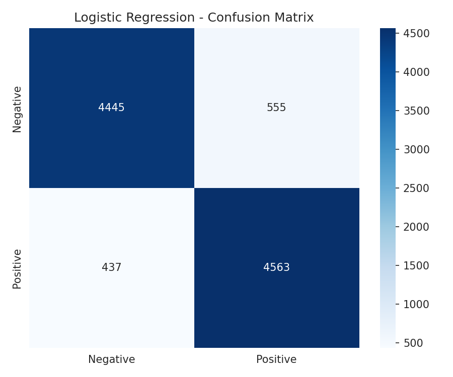

# 🎬 Movie Reviews Sentiment Analysis

[](https://colab.research.google.com/github/ErenKaya10/Movie-Reviews-Analysis/blob/main/movie_reviews_analysis.ipynb)
[](https://www.python.org/downloads/)
[](https://scikit-learn.org/)
[](https://opensource.org/licenses/MIT)

##  Project Overview

This project performs sentiment analysis on IMDb movie reviews comparing two different approaches:

- **Traditional Machine Learning**: Logistic Regression, Naive Bayes, SVM, Random Forest (with TF-IDF and CountVectorizer)
- **Zero-shot Classification**: Facebook BART-large-mnli (no training required!)

## Dataset

**IMDb 50K Movie Reviews** ([Kaggle](https://www.kaggle.com/datasets/lakshmi25npathi/imdb-dataset-of-50k-movie-reviews))
- 50,000 reviews (25K positive, 25K negative)
- Balanced classes
- Average review length varies

## 🚀 Traditional Models Performance

### TF-IDF Results
| Model | Accuracy | Training Time |
|-------|----------|---------------|
| **Logistic Regression** | **90.08%** | 0.30s |
| Linear SVM | 89.10% | 0.89s |
| Naive Bayes | 86.40% | 0.04s |
| Random Forest | 83.40% | 13.21s |

### CountVectorizer Results
| Model | Accuracy | Training Time |
|-------|----------|---------------|
| Logistic Regression | 87.60% | 2.91s |
| Naive Bayes | 85.79% | 0.03s |
| Linear SVM | 85.10% | 45.62s |
| Random Forest | 83.48% | 9.88s |

### Vectorizer Comparison
| Model | Count | TF-IDF | Difference |
|-------|-------|--------|------------|
| Logistic Regression | 87.60% | **90.08%** | +2.48% |
| Naive Bayes | 85.79% | 86.40% | +0.61% |
| Linear SVM | 85.10% | 89.10% | +4.00% |
| Random Forest | 83.48% | 83.40% | -0.08% |

** Best Model:** Logistic Regression + TF-IDF (**90.08% accuracy**)

*Note: Random Forest performance could be improved with hyperparameter tuning, but training time was a limiting factor.*

##  Zero-shot Classification Results

Results using Facebook BART-large-mnli with **no training**:

| Metric | Value |
|--------|-------|
| **Accuracy** | **86.00%** |
| Sample Size | 50 reviews |
| Average Confidence | 0.829 |
| Traditional Model | 90.08% |

### Sample Predictions
"Father of the Pride was another of those good shows..."
True: Positive | Pred: Negative (conf: 0.597) ✗

"What a dreadful movie. The effects were poor..."
True: Negative | Pred: Negative (conf: 0.934) ✓

"This movie was on British TV last night, and is wonderful!"
True: Positive | Pred: Positive (conf: 0.979) ✓


## 📊 Visual Analysis


*Figure 1: Dataset distribution and text length analysis.*


*Figure 2: Model and vectorization accuracy comparison.*

## Key Findings

**Speed vs. Accuracy:** Traditional models (Logistic Regression) deliver results in milliseconds, while Zero-shot takes several seconds per review.

**Data Efficiency:** Traditional models require 40,000+ training samples, while Zero-shot achieves 86% accuracy with **zero training data** - remarkable!

### Zero-shot Struggles With:
- Irony and sarcasm
- Comparative statements ("good but not as good as the first")

##  Technologies Used

- **Python 3.8+**
- **scikit-learn**: Traditional ML models
- **Transformers (Hugging Face)**: Zero-shot classification
- **PyTorch**: Deep learning backend
- **Pandas/NumPy**: Data processing
- **Matplotlib/Seaborn**: Visualizations
- **WordCloud**: Word cloud generation

##  Project Structure

```bash
Movie-Reviews-Analysis/
├── data/
│   └── IMDB Dataset.csv         # Raw dataset
├── movie_reviews_analysis.ipynb  # Traditional ML models
├── zero_shot_classification.ipynb # Zero-shot analysis (LLM)
├── images/                       # Visual outputs
├── requirements.txt              # Dependencies
├── README.md                      # English documentation
└── README[TR].md                   # Turkish documentation

Getting Started
Run in Colab (Recommended)
Click the "Open In Colab" badge above

Mount your Google Drive

Run all cells (Runtime → Run all)

Local Installation

git clone https://github.com/ErenKaya10/Movie-Reviews-Analysis.git
cd Movie-Reviews-Analysis
pip install -r requirements.txt
jupyter notebook


