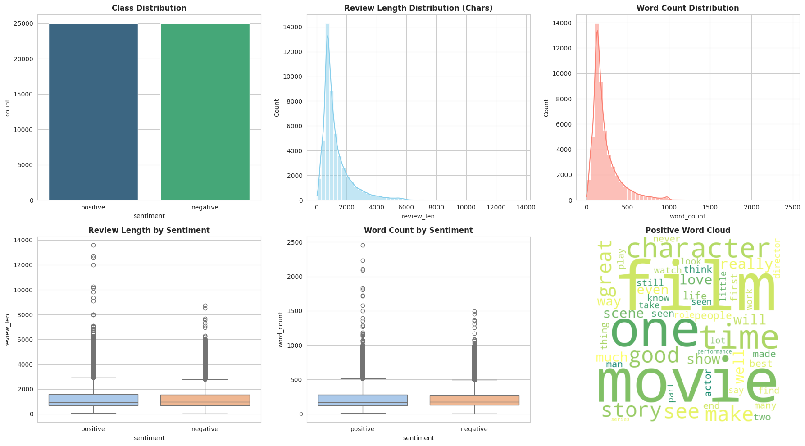

# Film Yorumları Duygu Analizi

[](https://colab.research.google.com/github/ErenKaya10/Movie-Reviews-Analysis/blob/main/movie_reviews_analysis.ipynb)
[](https://www.python.org/downloads/)
[](https://scikit-learn.org/)
[](https://opensource.org/licenses/MIT)

##  Proje Hakkında

Bu proje, IMDb film yorumları üzerinde duygu analizi yaparak iki farklı yaklaşımı karşılaştırır:

- **Geleneksel Makine Öğrenmesi**: Logistic Regression, Naive Bayes, SVM, Random Forest (TF-IDF ve CountVectorizer ile)
- **Zero-shot Sınıflandırma**: Facebook BART-large-mnli (hiç eğitim gerektirmez!)

##  Veri Seti

**IMDb 50K Film Yorumları** (https://www.kaggle.com/datasets/lakshmi25npathi/imdb-dataset-of-50k-movie-reviews)
- 50,000 yorum (25K pozitif, 25K negatif)
- Dengeli sınıflar
- Ortalama yorum uzunluğu


##  Geleneksel Modeller Performansı

### TF-IDF Sonuçları
| Model | Doğruluk | Eğitim Süresi |
|-------|----------|---------------|
| **Logistic Regression** | **%90.08** | 0.30s |
| Linear SVM | %89.10 | 0.89s |
| Naive Bayes | %86.40 | 0.04s |
| Random Forest | %83.40 | 13.21s |

### CountVectorizer Sonuçları
| Model | Doğruluk | Eğitim Süresi |
|-------|----------|---------------|
| Logistic Regression | %87.60 | 2.91s |
| Naive Bayes | %85.79 | 0.03s |
| Linear SVM | %85.10 | 45.62s |
| Random Forest | %83.48 | 9.88s |

### Vektörizasyon Karşılaştırması
| Model | Count | TF-IDF | Fark |
|-------|-------|--------|------|
| Logistic Regression | %87.60 | **%90.08** | +%2.48 |
| Naive Bayes | %85.79 | %86.40 | +%0.61 |
| Linear SVM | %85.10 | %89.10 | +%4.00 |
| Random Forest | %83.48 | %83.40 | -%0.08 |

 En İyi Model: Logistic Regression + TF-IDF (**%90.08 doğruluk**)

Not: Eğitim süresinin uzunluğundan dolayı hiperparametre ayarlamasıyla Rastgele Orman algoritması geliştirilebilir.

##  Zero-shot Sınıflandırma Sonuçları

Facebook BART-large-mnli modeli ile **hiç eğitim yapmadan** elde edilen sonuçlar:

| Metrik | Değer |
|--------|-------|
| **Doğruluk** | **%86.00** |
| Örneklem Sayısı | 50 yorum |
| Ortalama Güven | 0.829 |
| Geleneksel Model | %90.08 |

### Örnek Tahminler

"Father of the Pride was another of those good shows..."
Gerçek: Pozitif | Tahmin: Negatif (güven: 0.597) ✗

"What a dreadful movie. The effects were poor..."
Gerçek: Negatif | Tahmin: Negatif (güven: 0.934) ✓

"This movie was on British TV last night, and is wonderful!"
Gerçek: Pozitif | Tahmin: Pozitif (güven: 0.979) ✓

##  Görsel Analiz

*Şekil 1: Veri seti dağılımı ve metin uzunluk analizi.*


*Şekil 2: Modellerin ve vektörizasyon yöntemlerinin doğruluk karşılaştırması.*

##  Önemli Bulgular

Hız vs. Doğruluk: Geleneksel modeller (Logistic Regression) milisaniyeler içinde sonuç verirken, Zero-shot modelinin bir yorumu analiz etmesi birkaç saniye sürebiliyor.

Veri İhtiyacı: Geleneksel modeller 40.000+ veriye ihtiyaç duyarken, Zero-shot modelinin hiç veriye ihtiyaç duymadan %86 başarı yakalaması dikkat çekici.

###  Zero Shot'ın Zorlandığı Durumlar:
- İroni ve alaycılık
- Karşılaştırmalı ifadeler ("iyi ama ilki kadar değil")

##  Kullanılan Teknolojiler

- **Python 3.8+**
- **scikit-learn**: Geleneksel ML modelleri
- **Transformers (Hugging Face)**: Zero-shot sınıflandırma
- **PyTorch**: Derin öğrenme altyapısı
- **Pandas/NumPy**: Veri işleme
- **Matplotlib/Seaborn**: Görselleştirme
- **WordCloud**: Kelime bulutları

##  Proje Yapısı
```bash
Movie-Reviews-Analysis/
├── data/
│   └── IMDB Dataset.csv         # Ham veri seti
├── movie_reviews_analysis.ipynb # Geleneksel modeller (ML)
├── zero_shot_classification.ipynb # Zero-shot analizi (LLM)
├── images/                      # Görsel çıktılar 
├── requirements.txt             # Gerekli kütüphaneler
├── README.md                    # İngilizce dokümantasyon
└── README[TR].md                 # Türkçe dokümantasyon


  Başlarken

 Colab'de Çalıştır (Önerilen)
1. Yukarıdaki "Open In Colab" rozetine tıklayın
2. Google Drive'ınızı bağlayın
3. Tüm hücreleri çalıştırın (Runtime → Run all)

 Yerel Kurulum

git clone https://github.com/ErenKaya10/Movie-Reviews-Analysis.git
cd Movie-Reviews-Analysis
pip install -r requirements.txt
jupyter notebook


